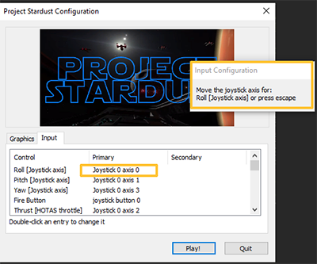

# Project Stardust

X-Wing VR Simulator made in Unity for SteamVR enabled devices.

*Unity ver. 2019.2.6f1
SteamVR ver. 1.11.11*

###  User Instructions

Current stable release : 0.8.1 / May 9, 2020 - Created by Dylan Stout

Here you will find some of the most common instructions for running and setting up Project Stardust. To provide the best possible user experience, it is suggested to follow at least the setup instructions. Controls layouts are shown here and can be remapped via the SteamVR interfaces (instructions below). Make sure you are using the most recent version by comparing the version number on your main menu with that on my website (Download latest button below).

[Download Latest](http://saltyhash.org/2019/12/13/project-stardust-update/) [Report Bugs](https://docs.google.com/forms/d/e/1FAIpQLSeW1BXtR9uDo0qY8hvyiCBXZ62s7-lwv2Gurwtgk06w1F5Fog/viewform?usp=sf_link)

### Deployment Usage Instructions

1.  Unzip entire contents of "Project Stardust vX.zip" to install directory of your choice. (X to signify version number)
2.  [Install SteamVR](https://store.steampowered.com/app/250820/SteamVR/) if not already installed (Free)
3.  Run "Project Stardust.exe" to launch game. This should open SteamVR and VR platform specific software to run game, along with the game launcher.
4.  At game launcher, select graphical quality and resolution for your system capabilities.

Default - 2k Textures, no Anti-aliasing, Bloom lowest quality, no shadows
High - 4k Textures, 2x MSAA, Bloom medium quality, no shadows
Ultra - 4k Textures, 4x MSAA, Bloom highest quality, medium view distance shadows

5.  (Optional) If VR controllers used, check controls layout in readme and follow instructions to remap to your liking in SteamVR settings.
6.  (Optional) If HOTAS controller used, check controls layout in readme and follow instructions to remap to your liking in game launcher settings.
7.  Click "Play" to launch Project Stardust and continue in VR headset
8.  Point VR controllers at menu items and press UI Interaction button to navigate main menu.
9.  If controllers do not show up continue to troubleshooting steps

### Controller Layout (Defaults)

The following have controls mappings:

*   [Oculus Touch]()
*   [Valve Index Knuckles]()
*   [HTC Vive Wands]()
*   [WMR Motion Controllers]()
*   [HOTAS (Thrustmaster X)]()

### Restore Default Input & Video Settings

*   **To manually reset:** Use registry editor to delete entire registry folder at Computer\\HKEY\_CURRENT\_USER\\Software\\Dylan Stout\\Project Stardust
*   **To reset through script:** Run (as administrator) the **reset\_defaults.bat** batch script located in the root of Project Stardust installation directory. Follow the prompts.

### Dashboard Controls Layout

### Map Custom Controls

*   [VR Controllers \[SteamVR\]](#tabContent27)
*   [Hotas Controllers \[Launcher\]](#tabContent28)
*   [Keyboard / Gamepad \[Launcher\]](#tabContent29)

To map custom controls for VR Controllers follow these instructions:

1.  Launch Project Stardust via launcher by clicking "Play!"
  
  
  
6.  Allow Project Stardust to load into main menu
  
  
  
11.  Alt-Tab out of game if necessary so SteamVR popup is visible. Then right-click SteamVR popup and select "Settings"
  
  
  
16.  In SteamVR settings window select "Controllers" then "Manage Controller Bindings"
  
  
  
21.  In "Manage Controller Bindings For:" dropdown menu, select "Project Stardust"
  
  
  
  
  
29.  Under the dropdown menu, change "Active Controller Binding" to "Custom"
  
  
  
34.  To edit the current mappings, select "Edit this Binding", which will open a window and allow managment of both "Default" (UI interaction) and "Flight" (X-Wing controls) profiles.

1.  Controls **NOT** marked as optional must be mapped in order to participate in core gameplay functions.
2.  When finished editing bindings select "Save Personal Bindings" to allow SteamVR to remember these mappings.

  
  
  

To map custom controls for HOTAS controllers follow these instructions:

1.  Open Project Stardust launcher by double-clicking "Project Stardust.exe" and select the "Input" tab to view current bindings for HOTAS. **IMPORTANT: Dependent on your system configuration your HOTAS joystick number may not be "Joystick 0". If you manually map controls in steps below it will detect your joystick and axis numbers that are specific to your HOTAS setup**.
  
  
  
6.  Double-click the Control's primary input that you wish to change and the launcher will prompt you to provide an input for this action

*   For buttons, you will be prompted to press a button on your HOTAS to map. Input should be automatically detected.
*   For Joystick Axis, you will be prompted to push/rotate axis to map. Input should be automatically detected.

  
  
  

To map custom controls for Keyboard / Gamepad controllers follow these instructions:

1.  Open Project Stardust launcher by double-clicking "Project Stardust.exe" and select the "Input" tab to view current bindings. **IMPORTANT: Keyboards and gamepads are not supported by default. Keyboards can not be used alone since a joystick axis of some type is required for pitch/yaw/roll. However, mapping them with the steps below should allow you to use a keyboard and controller combination.**.
  
  
  
6.  Double-click the Control's primary input that you wish to change and the launcher will prompt you to provide an input for this action

*   For buttons, you will be prompted to press a button on your Keyboard / Gamepad to map. Input should be automatically detected.
*   For Joystick Axis, you will be prompted to push/rotate an axis on Gamepad to map. Input should be automatically detected.

  
  
  

### Troubleshooting

Troubleshooting information will go here

### About / Contact

[Report Issues & Bugs Here](https://docs.google.com/forms/d/e/1FAIpQLSeW1BXtR9uDo0qY8hvyiCBXZ62s7-lwv2Gurwtgk06w1F5Fog/viewform?usp=sf_link)

Contact information will go here

